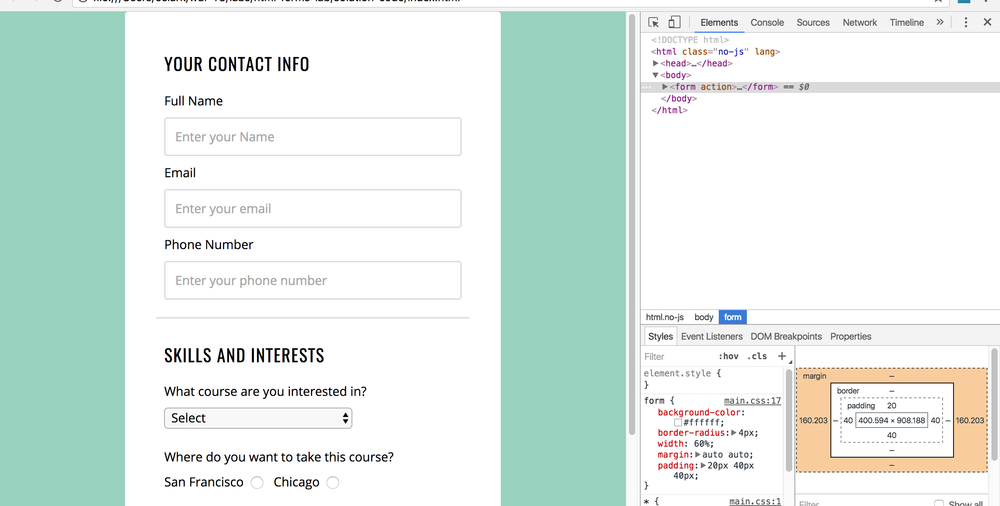
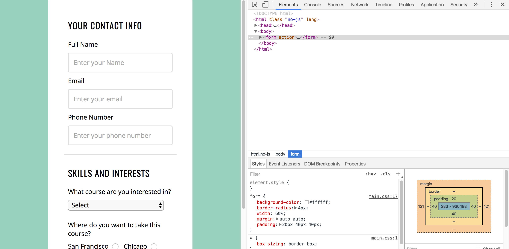

Hey guys, I pushed solutions for the two labs today.

Here are my forks of the repos.

[Design CSS Challenge Lab](https://github.com/Hoten/design-css-challenge-lab)

[HTML Forms Lab](https://github.com/Hoten/html-forms-lab)

I wanted to talk about the styling part for the forms lab. Check out my solution- you'll see that I'm using a `normalize.css` file. Connor, what's that? Well, that's just a whole bunch of rules that does a "reset" for the default styles for the browser. What it does, how it does it, isn't important. Toggle that line in the HTML (line 10) and you'll find that nothing drastic changes. Minor stuff.

So, for the important styling, look at `main.css`. Specifically, see the styling for `form`. The two properties responsible for giving our page that cool, centered, green aesthetic are these:

```
width: 60%;
margin: 40px auto;
```

The first line sets the width of the form to be 60% of the page. With just this set, the form hugs up to the top-left of the page. The rest of the screen shows the body's background color (green-ish).

The second line is the cool part. Remember, margin is the space between this element (the form) and other elements (including the edges of the page!). In this case, we are setting the vertical and the horizontal margins. AKA: `margin: <vertical> <horizontal>`. So, 40px for the top and the bottom, and auto for the left and the right.

Connor, what the heck is auto? Here, we tell the browser, "YOU set the horizontal margins, you browser, you!". The browser responds "OK. I don't have any bias here so...I'll split up the margins for the left and right evenly". The result- the form gets centered horizontally.

Let's check out the form's box element in the Chrome Developer Tools.


Left and right margins are equal. About 160 each.


I resized the screen a bit, and the margin adjusted accordingly. And, they are still equal.

`margin: <x> auto` is really useful, this in combination with setting the `width` property lets us create a nice, centered aesthetic.

The rest of the styling for the page is fairly straightforward. Please do check out the CSS in my solution. Comment out one block of styling at a time, and see what gets removed from the page. Understand how each block of styling contributes to the overall styling of the page.
